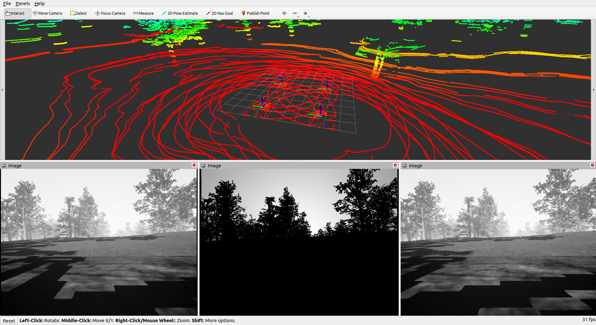

# UE4_ROS_driver
## How to build
```
sudo apt-get install ros-$ROS_DISTRO-mavros ros-$ROS_DISTRO-mavros-extras
mkdir -p catkin_ws/src
cd catkin_ws/src
git clone https://github.com/lhc610github/UE4_ROS_driver
cd ..
catkin build
```

## How to use
For single drone:
```
source devel/setup.bash
roslaunch ue4_ros_drivers test.launch
```
For multi drones:
```
source devel/setup.bash
roslaunch ue4_ros_drivers multi_test.launch robot:=drone$ID use_sim_time:=$SIM_TIME
```

`$ID: {1,2,3,4}`

`$SIM_TIME: {true, false}`

This script will launch one node for one specific drone.
Here is an example of `tmuxinator` configuration to launch four drones.
```
name: ue4_ros_test
root: ~/

windows:
  - multidrones:
      root: catkin_ws # folder path
      layout: b03f,205x54,0,0{102x54,0,0[102x27,0,0,0,102x26,0,28,3],102x54,103,0[102x27,103,0,1,102x26,103,28,2]}
      panes:
        - drone1:
            - source devel/setup.zsh
            - roslaunch ue4_ros_drivers multi_test.launch robot:=drone1
        - drone2:
            - source devel/setup.zsh
            - sleep 5
            - roslaunch ue4_ros_drivers multi_test.launch robot:=drone2 use_sim_time:=false
        - drone3:
            - source devel/setup.zsh
            - sleep 5
            - roslaunch ue4_ros_drivers multi_test.launch robot:=drone3 use_sim_time:=false
        - drone4:
            - source devel/setup.zsh
            - sleep 5
            - roslaunch ue4_ros_drivers multi_test.launch robot:=drone4 use_sim_time:=false
```
## Configuration
Config IP address and port number for your ROS PC and UE4 game PC.

`config/drone$ID/node.yaml:`
```
# drone1/node.yaml:

left_cam_driver:
  address: 192.168.1.180 # ROS_PC IP address
  port: 6766
  topic: camera/left
  is_depth_img: false
right_cam_driver:
  address: 192.168.1.180 # ROS_PC IP address
  port: 6767
  topic: camera/rigth
  is_depth_img: false
depth_cam_driver:
  address: 192.168.1.180 # ROS_PC IP address
  port: 6768
  topic: camera/depth
  is_depth_img: true
imu_driver:
  address: 192.168.1.180 # ROS_PC IP address
  port: 6769
  topic: imu
lidar:
  address: 192.168.1.180 # ROS_PC IP address
  port: 6773
  topic: scan
att_controller:
  address: 192.168.1.23 # UE4_WINDOWS_PC IP address
  port: 6771
  topic: control_cmd
ground_truth:
  address: 192.168.1.180 # ROS_PC IP address
  port: 6775
  topic: ground_truth_odom
```

`config/drone$ID/node.yaml:` <===> `$UE4_WINDOWS_FOLDER/Blocks/Config/Node$ID.json`
```
{
    "left_camera": {
        "address": "192.168.1.180", <--- ROS_PC IP address
        "port": 6766
    },
    "right_camera": {
        "address": "192.168.1.180", <--- ROS_PC IP address
        "port": 6767
    },
    "depth_camera": {
        "address": "192.168.1.180", <--- ROS_PC IP address
        "port": 6768
    },
    "imu": {
        "address": "192.168.1.180", <--- ROS_PC IP address
        "port": 6774
    },
    "lidar": {
        "address": "192.168.1.180", <--- ROS_PC IP address
        "port": 6773
    },
    "att_controller": {
        "address": "192.168.1.23", <--- UE4_WINDOWS_PC IP address
        "port": 6771
    },
    "ground_truth": {
        "address": "192.168.1.180", <--- ROS_PC IP address
        "port": 6775
    }
}
```
## Demo
